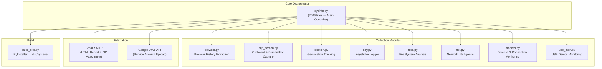
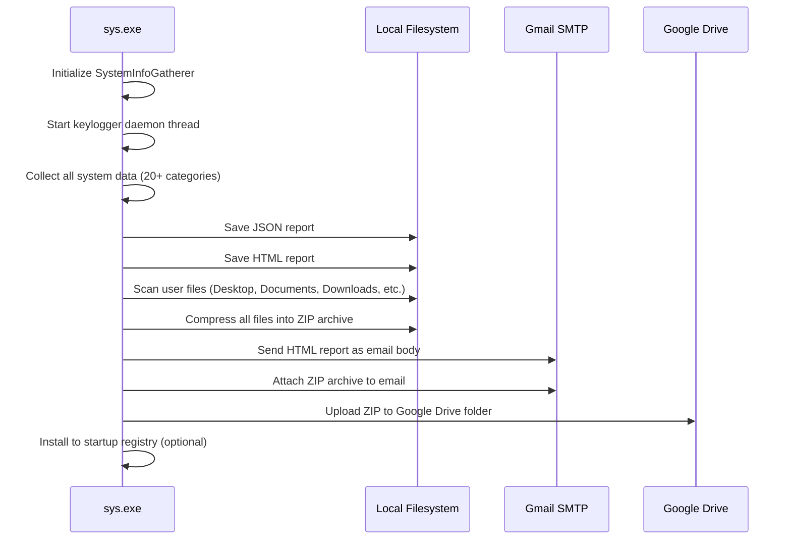

# Offensive Security Research Project — Technical Report

## sys-SPYWARE: Windows System Intelligence & Data Collection Framework

---

| **Field**             | **Detail**                                      |
|-----------------------|-------------------------------------------------|
| **Author**            | Bhuvan Kumar HM                                 |
| **Date**              | 15 May 2026                                     |
| **Submission**        | University Degree Project & OffSec OSCP+ Board  |
| **Platform**          | Microsoft Windows 10/11 (x64)                   |
| **Language**          | Python 3.x                                      |
| **Repository**        | `BHUVAN2525/warepy` (GitHub)                     |
| **Classification**    | Offensive Security Research — Educational Use    |

---

## Table of Contents

1. [Executive Summary](#1-executive-summary)
2. [Project Objectives](#2-project-objectives)
3. [Architecture Overview](#3-architecture-overview)
4. [Module Analysis](#4-module-analysis)
5. [Data Flow & Exfiltration Pipeline](#5-data-flow--exfiltration-pipeline)
6. [MITRE ATT&CK Mapping](#6-mitre-attck-mapping)
7. [Build & Deployment](#7-build--deployment)
8. [Detection & Mitigation Analysis](#8-detection--mitigation-analysis)
9. [Ethical & Legal Considerations](#9-ethical--legal-considerations)
10. [Conclusion](#10-conclusion)
11. [References](#11-references)

---

## 1. Executive Summary

This report documents the design, implementation, and analysis of **sys-SPYWARE**, a modular Windows-based offensive security research tool developed in Python. The project demonstrates real-world attack techniques used in advanced persistent threats (APTs) and post-exploitation scenarios, covering the full kill-chain from initial access artifacts through data collection, staging, and exfiltration.

The framework comprises **10 specialized modules** that collectively gather system intelligence, monitor user activity, harvest sensitive data, and exfiltrate collected information via email and cloud storage. The tool is compiled into a standalone Windows executable (`.exe`) for deployment in controlled test environments.

> [!IMPORTANT]
> This project was developed **exclusively for educational and research purposes** as part of an academic degree program and OSCP+ certification preparation. All testing was conducted on systems owned by the author with explicit authorization.

---

## 2. Project Objectives

1. **Demonstrate post-exploitation tradecraft** — Implement techniques commonly observed in real-world threat actor toolkits to understand adversary methodologies.
2. **Map to MITRE ATT&CK** — Categorize each capability against the ATT&CK framework to bridge offensive and defensive understanding.
3. **Analyze detection surfaces** — For each implemented technique, document how blue teams and EDR/AV solutions can detect and mitigate the activity.
4. **Build operational awareness** — Develop hands-on proficiency with Windows internals, Win32 API, WMI, and Python ctypes for security assessments.

---

## 3. Architecture Overview



### File Structure

| File               | Lines | Size     | Purpose                                          |
|--------------------|-------|----------|--------------------------------------------------|
| `sysinfo.py`       | 2,006 | 93.1 KB  | Core orchestrator, data aggregation, reporting    |
| `browser.py`       | 250   | 8.9 KB   | Chrome, Firefox, Edge, Safari history extraction  |
| `clip_screen.py`   | 348   | 13.4 KB  | Clipboard read/write, screenshot discovery        |
| `location.py`      | 414   | 16.9 KB  | IP/WiFi/GPS/Cell tower geolocation                |
| `files.py`         | 515   | 21.9 KB  | File system scanning, hashing, monitoring         |
| `key.py`           | 88    | 2.6 KB   | Keystroke logger with email reporting             |
| `net.py`           | 250   | 8.9 KB   | Network interface & connection monitoring         |
| `process.py`       | 253   | 10.0 KB  | Process enumeration, network connections          |
| `usb_mon.py`       | 448   | 17.9 KB  | USB device enumeration, hub details, monitoring   |
| `build_exe.py`     | ~100  | 3.6 KB   | PyInstaller build script for `.exe` generation    |

---

## 4. Module Analysis

### 4.1 Core Orchestrator — `sysinfo.py`

The main controller module that instantiates all sub-modules and aggregates collected data into a unified report.

**Key Capabilities:**
- **SystemInfoGatherer class** — Central class with 20+ collection methods
- **Data aggregation** — `get_all_system_info()` calls all modules and returns a unified JSON dictionary
- **Report generation** — Produces both plain-text and professional HTML reports with CSS styling
- **Email delivery** — SMTP-based email with HTML body + ZIP attachment via Gmail
- **Cloud upload** — Google Drive API integration using service account credentials
- **Startup persistence** — Registry-based auto-start installation (`--install` / `--uninstall`)

**Technical Details:**
- Uses `wmi.WMI()` for deep Windows system queries (Win32_Processor, Win32_BaseBoard, Win32_BIOS, etc.)
- Leverages `psutil` for cross-platform process/network/disk/memory monitoring
- Employs `ctypes` + `wintypes` for low-level Windows API access
- Integrates `winreg` for Windows Registry operations
- Multi-threaded keylogger runs as a daemon thread on initialization

**Data Collected:**
| Category              | Data Points                                                              |
|-----------------------|--------------------------------------------------------------------------|
| System                | OS version, architecture, hostname, IP, boot time, uptime               |
| CPU                   | Name, cores, frequency, per-core usage                                   |
| Memory                | Total/used/available RAM, swap statistics                                |
| Disk                  | All partitions — device, filesystem, size, usage                         |
| GPU                   | Adapter name, VRAM, driver version                                       |
| Motherboard           | Manufacturer, product, serial number                                     |
| BIOS                  | Manufacturer, version, release date                                      |
| Network               | Interfaces, IP addresses, WiFi profiles, DNS, active TCP connections     |
| Browser History       | Chrome, Edge, Firefox — URL, title, visit timestamp                      |
| Clipboard             | Text content, image detection, content type enumeration                  |
| Screenshots           | Discovery in common paths, metadata (size, modified date)                |
| Keystrokes            | Key press events with timestamps, log file path                          |
| Location              | IP geolocation, WiFi networks, GPS devices, cell towers                  |
| Files                 | Desktop/Documents/Downloads/Pictures/Videos/Music/AppData scanning       |
| USB                   | Connected devices, controllers, hubs, removable drives                   |
| Processes             | PID, name, user, CPU%, memory%, executable path, command line            |
| Installed Software    | Registry-based enumeration (name, version, vendor, install date)         |
| Running Services      | Service name, display name, state, start mode                            |
| Startup Programs      | Registry Run keys enumeration                                            |
| Environment Variables | Complete environment variable dump                                       |

---

### 4.2 Browser History — `browser.py`

**Technique:** SQLite database extraction from browser profile directories.

**Implementation:**
1. Locates browser history databases at known filesystem paths
2. Creates a copy of the locked SQLite database to avoid access conflicts
3. Queries the `urls` table (Chromium-based) or `moz_places`/`moz_historyvisits` (Firefox)
4. Extracts URL, page title, and last visit timestamp
5. Cleans up temporary database copy

**Supported Browsers:** Chrome, Firefox, Edge, Safari (macOS)

**ATT&CK Technique:** T1217 — Browser Information Discovery

---

### 4.3 Clipboard & Screenshots — `clip_screen.py`

**Clipboard Operations:**
- Uses Win32 Clipboard API (`win32clipboard`) to read text (`CF_TEXT`, `CF_UNICODETEXT`) and images (`CF_DIB`)
- Monitors clipboard changes at configurable intervals
- Maintains clipboard history with timestamps

**Screenshot Operations:**
- Scans common screenshot directories (Desktop, Pictures/Screenshots, OneDrive)
- Filters by filename keywords (screenshot, screen, capture, snip)
- Returns metadata: path, modification time, file size

**ATT&CK Techniques:** T1115 — Clipboard Data, T1113 — Screen Capture

---

### 4.4 Location Tracking — `location.py`

**Multiple Location Sources:**
1. **IP Geolocation** — Public IP via `api.ipify.org`, geocoding via `ipapi.co`
2. **WiFi Networks** — WMI `Win32_NetworkAdapterConfiguration` enumeration
3. **GPS Devices** — WMI `Win32_PnPEntity` scanning for GPS hardware
4. **Cell Towers** — WMI enumeration for cellular modem devices

**ATT&CK Technique:** T1614 — System Location Discovery

---

### 4.5 Keystroke Logger — `key.py`

**Implementation:**
- Uses `pynput.keyboard.Listener` for key press capture
- Logs to `%APPDATA%\system_logs.txt` with ISO timestamps
- Daemon thread — starts automatically with `SystemInfoGatherer.__init__()`
- Periodic email reporting (configurable interval, default 5 minutes)

**ATT&CK Technique:** T1056.001 — Input Capture: Keylogging

---

### 4.6 File System Analysis — `files.py`

**Capabilities:**
- Recursive directory scanning with file metadata (size, timestamps, attributes, owner)
- SHA-256 hash calculation for integrity verification
- File search by name pattern, extension, size range, date range
- Duplicate file detection via hash comparison
- Real-time file system monitoring using `watchdog` library
- Windows file attribute detection (hidden, readonly, system flags)
- DACL/permissions extraction via `win32security`

**ATT&CK Techniques:** T1083 — File and Directory Discovery, T1005 — Data from Local System

---

### 4.7 Network Intelligence — `net.py` & `process.py`

**Network Monitoring:**
- Interface enumeration with IPv4/IPv6 addresses, netmask, broadcast
- Real-time I/O statistics (bytes/packets sent/received per interface)
- Active TCP connection listing with PID and process name resolution
- Listening port enumeration
- Ping and traceroute utilities

**Process Monitoring:**
- Full process enumeration: PID, name, username, CPU%, memory%, executable path, command line
- Access denied handling for protected system processes

**ATT&CK Techniques:** T1049 — System Network Connections Discovery, T1057 — Process Discovery

---

### 4.8 USB Device Monitoring — `usb_mon.py`

**Capabilities:**
- USB device enumeration via WMI (`Win32_PnPEntity`, `Win32_USBController`, `Win32_USBHub`)
- Removable drive detection and metadata (volume name, filesystem, capacity, serial number)
- Real-time USB connect/disconnect monitoring
- USB hub port topology mapping
- Drive ejection via WMI

**ATT&CK Technique:** T1120 — Peripheral Device Discovery

---

## 5. Data Flow & Exfiltration Pipeline



### Exfiltration Channels

1. **Email (Primary):** SMTP over TLS to Gmail (`smtp.gmail.com:587`) with App Password authentication. HTML-formatted report as email body, ZIP archive as attachment.

2. **Google Drive (Secondary):** Google Drive API v3 with service account credentials. Creates timestamped subfolder, uploads individual files + compressed archive.

**ATT&CK Techniques:** T1567.002 — Exfiltration Over Web Service: Exfiltration to Cloud Storage, T1048 — Exfiltration Over Alternative Protocol

---

## 6. MITRE ATT&CK Mapping

| ATT&CK ID    | Technique                              | Module                     |
|---------------|----------------------------------------|----------------------------|
| T1005         | Data from Local System                 | `files.py`, `sysinfo.py`   |
| T1025         | Data from Removable Media              | `usb_mon.py`               |
| T1039         | Data from Network Shared Drive         | `files.py`                 |
| T1041         | Exfiltration Over C2 Channel           | `sysinfo.py` (email)       |
| T1048         | Exfiltration Over Alt Protocol         | `sysinfo.py` (SMTP)        |
| T1049         | System Network Connections Discovery   | `process.py`, `net.py`     |
| T1056.001     | Input Capture: Keylogging              | `key.py`, `sysinfo.py`     |
| T1057         | Process Discovery                      | `process.py`, `sysinfo.py` |
| T1082         | System Information Discovery           | `sysinfo.py`               |
| T1083         | File and Directory Discovery           | `files.py`, `sysinfo.py`   |
| T1113         | Screen Capture                         | `clip_screen.py`           |
| T1115         | Clipboard Data                         | `clip_screen.py`           |
| T1120         | Peripheral Device Discovery            | `usb_mon.py`               |
| T1217         | Browser Information Discovery          | `browser.py`               |
| T1547.001     | Registry Run Keys / Startup Folder     | `sysinfo.py` (persistence) |
| T1567.002     | Exfil to Cloud Storage                 | `sysinfo.py` (Drive)       |
| T1614         | System Location Discovery              | `location.py`              |

---

## 7. Build & Deployment

### Build Process
```
python build_exe.py
```

- Uses **PyInstaller** to compile all modules into a single Windows executable
- Output: `dist/sys.exe`
- Includes all Python dependencies and data files
- Designed for silent execution (no console window)

### Execution Modes
| Mode         | Command                    | Description                        |
|--------------|----------------------------|------------------------------------|
| Silent Auto  | `sys.exe` or `--auto`      | Runs all collection, emails, exits |
| Interactive  | `sys.exe --menu`           | Interactive menu for testing       |
| Install      | `sys.exe --install`        | Adds to Windows startup            |
| Uninstall    | `sys.exe --uninstall`      | Removes from Windows startup       |

---

## 8. Detection & Mitigation Analysis

For each capability, the following detection and mitigation strategies are available:

### 8.1 Keylogger Detection
| Detection Method                       | Details                                                |
|----------------------------------------|--------------------------------------------------------|
| **API Hooking Detection**              | Monitor `SetWindowsHookEx` calls for `WH_KEYBOARD_LL` |
| **Process Behavior Analysis**          | Flag processes importing `pynput` or `pyHook`          |
| **File I/O Monitoring**               | Detect rapid, append-only writes to hidden log files   |
| **Mitigation**                         | Application whitelisting, EDR behavioral monitoring    |

### 8.2 Browser Data Theft Detection
| Detection Method                       | Details                                                |
|----------------------------------------|--------------------------------------------------------|
| **File Access Auditing**              | Monitor access to browser profile SQLite databases     |
| **Process-File Correlation**          | Flag non-browser processes reading History/Login Data  |
| **Mitigation**                         | OS-level browser data encryption, audit policies       |

### 8.3 Clipboard Monitoring Detection
| Detection Method                       | Details                                                |
|----------------------------------------|--------------------------------------------------------|
| **Clipboard Listener Enumeration**    | Detect `AddClipboardFormatListener` registrations      |
| **Periodic Access Patterns**          | Flag repeated `OpenClipboard` calls from unusual PIDs  |
| **Mitigation**                         | Clipboard isolation, credential manager usage          |

### 8.4 Exfiltration Detection
| Detection Method                       | Details                                                |
|----------------------------------------|--------------------------------------------------------|
| **Network Monitoring**               | Flag SMTP traffic from non-email client processes      |
| **DNS Monitoring**                    | Detect `smtp.gmail.com` resolution from unusual sources|
| **Cloud API Detection**              | Monitor Google Drive API calls from unsigned binaries   |
| **Volume-Based Alerts**              | Flag large outbound data transfers (ZIP attachments)   |
| **Mitigation**                         | Egress filtering, DLP solutions, email gateway rules   |

### 8.5 Persistence Detection
| Detection Method                       | Details                                                |
|----------------------------------------|--------------------------------------------------------|
| **Registry Monitoring**              | Autoruns/Sysmon monitoring of Run key modifications    |
| **Startup Folder Auditing**          | Monitor additions to startup folders                   |
| **Mitigation**                         | Registry access controls, GPO restrictions             |

---

## 9. Ethical & Legal Considerations

> [!CAUTION]
> **Deploying this tool on systems without explicit written authorization is illegal** under the Computer Fraud and Abuse Act (CFAA), UK Computer Misuse Act, Indian IT Act (Sec 43, 66), and equivalent legislation worldwide.

### Authorized Use Cases
- **Penetration testing** with signed Rules of Engagement (RoE)
- **Red team exercises** within organizational scope
- **Academic research** in controlled lab environments
- **OSCP/OSEP certification** preparation on personal/lab systems

### Controls Implemented
- All testing conducted on author-owned systems
- Hardcoded credentials are for author's own accounts
- Google Drive folder is author's personal storage
- Email recipient is the author's own email address

---

## 10. Conclusion

This project demonstrates a comprehensive understanding of post-exploitation techniques, Windows internals, and data exfiltration methodologies. By implementing these capabilities from scratch in Python, the research provides:

1. **Deep technical understanding** of how real-world threats operate
2. **ATT&CK framework mapping** bridging offensive and defensive perspectives
3. **Detection analysis** for each technique, enabling blue team response development
4. **Practical skills** directly applicable to penetration testing and security assessment roles

The modular architecture allows individual techniques to be studied in isolation while the orchestrator demonstrates how adversaries chain capabilities into cohesive operations.

---

## 11. References

1. MITRE ATT&CK Framework — https://attack.mitre.org/
2. OffSec OSCP+ Certification — https://www.offsec.com/courses/pen-200/
3. Microsoft Win32 API Documentation — https://learn.microsoft.com/en-us/windows/win32/
4. Python `psutil` Documentation — https://psutil.readthedocs.io/
5. Python `pynput` Documentation — https://pynput.readthedocs.io/
6. WMI Classes Reference — https://learn.microsoft.com/en-us/windows/win32/cimwin32prov/
7. PyInstaller Documentation — https://pyinstaller.org/
8. Google Drive API v3 — https://developers.google.com/drive/api/v3/
