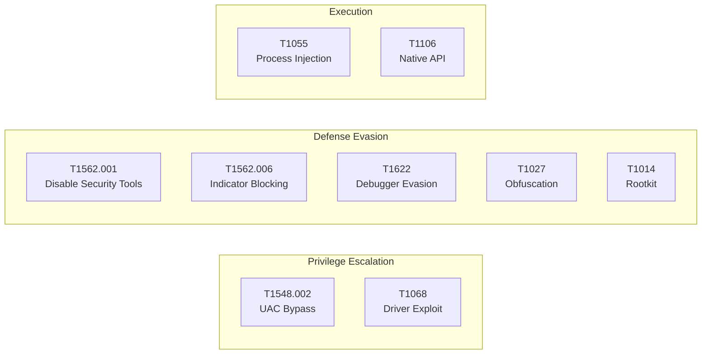

# Proposed Stealth & Evasion Modules — Technical Analysis Report

## Advanced Defense Evasion & Privilege Escalation Extensions

---

| **Field**          | **Detail**                                      |
|--------------------|-------------------------------------------------|
| **Author**         | Bhuvan Kumar HM                                 |
| **Date**           | 15 May 2026                                     |
| **Submission**     | University Degree Project & OffSec OSCP+ Board  |
| **Status**         | Proposed / Theoretical Analysis (Not Integrated) |
| **Classification** | Offensive Security Research — Educational Use    |

---

## 1. Executive Summary

This supplementary report analyzes **8 proposed stealth and evasion modules** that would extend the base sys-SPYWARE framework with advanced defense evasion, privilege escalation, and anti-analysis capabilities. Each module is documented with its technical implementation, MITRE ATT&CK mapping, real-world threat actor usage, and corresponding **detection and mitigation strategies**.

> [!IMPORTANT]
> These modules are analyzed **theoretically**. This report documents how each technique works, why threat actors use them, and how defenders can detect and prevent them.

---

## 2. Module Overview

| # | Module                  | File                      | ATT&CK Tactic          | Primary Technique              |
|---|-------------------------|---------------------------|-------------------------|--------------------------------|
| 1 | UAC Bypass              | `uacbypass.py`            | Privilege Escalation    | T1548.002 — Bypass UAC         |
| 2 | AMSI Bypass             | `amsi,bypass.py`          | Defense Evasion         | T1562.001 — Disable Security   |
| 3 | ETW Patching            | `ewtpatching.py`          | Defense Evasion         | T1562.006 — Indicator Blocking |
| 4 | Anti-Debugging          | `antidebugg.py`           | Defense Evasion         | T1622 — Debugger Evasion       |
| 5 | Shellcode Loaders       | `shellcodeloaders.py`     | Execution               | T1055 — Process Injection      |
| 6 | Defender Tampering      | `defendertamper.py`       | Defense Evasion         | T1562.001 — Disable Security   |
| 7 | Kernel Driver/Rootkit   | `kernaldriv,rootkits.py`  | Persistence/Evasion     | T1014 — Rootkit                |
| 8 | Encryption/Obfuscation  | `encrypt,obfusion.py`     | Defense Evasion         | T1027 — Obfuscated Files       |

---

## 3. Detailed Technical Analysis

### 3.1 UAC Bypass — `uacbypass.py` (137 lines)

**Purpose:** Elevate from medium integrity level to high/SYSTEM without triggering a UAC consent prompt.

**Techniques Implemented:**

| Method                  | Mechanism                                            | Auto-Elevate Binary    |
|-------------------------|------------------------------------------------------|------------------------|
| Fodhelper               | Registry hijack `ms-settings\Shell\Open\command`     | `fodhelper.exe`        |
| ComputerDefaults        | Same registry path as Fodhelper                      | `computerdefaults.exe` |
| Slui                    | Registry hijack `Exefile\Shell\Open\command`          | `slui.exe`             |
| Event Viewer            | Registry hijack `mscfile\Shell\Open\command`          | `eventvwr.exe`         |
| Sdclt                   | Registry hijack via App Paths                        | `sdclt.exe`            |
| CMSTPLUA COM            | COM interface auto-elevation (CLSID-based)           | COM object             |

**How It Works:**
1. Creates HKCU registry key pointing to attacker payload
2. Sets `DelegateExecute` value to trigger auto-elevation logic
3. Launches the legitimate auto-elevate binary (e.g., `fodhelper.exe`)
4. Windows auto-elevates the binary, which reads the hijacked registry key
5. Attacker payload executes at high integrity level
6. Registry key is cleaned up

**ATT&CK:** T1548.002 — Abuse Elevation Control Mechanism: Bypass User Account Control

**Real-World Usage:** APT29 (Cozy Bear), FIN7, Cobalt Strike

**Detection:**
- Monitor HKCU registry writes to `ms-settings\Shell\Open\command`
- Sysmon Event ID 13 (Registry value set) with target paths
- Child process monitoring of auto-elevate binaries
- **Mitigation:** Set UAC to "Always Notify", use Admin Approval Mode

---

### 3.2 AMSI Bypass — `amsi,bypass.py` (68 lines)

**Purpose:** Disable Windows Antimalware Scan Interface to prevent runtime content scanning.

**Techniques Implemented:**

1. **Memory Patching (`amsi_bypass_patch`):**
   - Loads `amsi.dll` into process
   - Resolves `AmsiScanBuffer` function address via `GetProcAddress`
   - Changes memory protection to `PAGE_EXECUTE_READWRITE` (0x40)
   - Overwrites function prologue with `mov eax, 0; ret` (always returns CLEAN)
   - Restores original memory protection

2. **String Obfuscation (`amsi_string_bypass`):**
   - Splits "amsi" string into individual characters to avoid static detection
   - Dynamically reconstructs the DLL name at runtime

**ATT&CK:** T1562.001 — Impair Defenses: Disable or Modify Tools

**Real-World Usage:** Nearly all modern PowerShell-based attack frameworks (Empire, PowerSploit)

**Detection:**
- ETW provider `Microsoft-Antimalware-Scan-Interface` event monitoring
- Memory integrity checks on `amsi.dll` code sections
- Monitor `VirtualProtect` calls targeting `amsi.dll` address space
- **Mitigation:** Constrained Language Mode, Script Block Logging, hardware-backed code integrity

---

### 3.3 ETW Patching — `ewtpatching.py` (62 lines)

**Purpose:** Disable Event Tracing for Windows to blind security telemetry and EDR sensors.

**Implementation:**
1. Gets handle to `ntdll.dll` via `GetModuleHandleW`
2. Resolves `EtwEventWrite` address via `GetProcAddress`
3. Patches function with `xor rax, rax; ret` (4 bytes: `48 33 C0 C3`)
4. This makes ALL ETW events return SUCCESS without actually logging

**Impact:** Disables telemetry for:
- Windows Defender ATP
- Process creation auditing
- .NET CLR events
- PowerShell script block logging
- EDR kernel callbacks that rely on ETW

**ATT&CK:** T1562.006 — Impair Defenses: Indicator Blocking

**Real-World Usage:** Cobalt Strike BOFs, Brute Ratel C4, Nighthawk

**Detection:**
- Kernel-mode ETW consumers (cannot be patched from user-mode)
- Integrity monitoring of `ntdll.dll` in-memory vs. on-disk
- Periodic `EtwEventWrite` function hash verification
- **Mitigation:** Kernel-mode ETW consumers, protected process light (PPL) for security services

---

### 3.4 Anti-Debugging — `antidebugg.py` (168 lines)

**Purpose:** Detect debugger attachment and evade dynamic analysis.

**Techniques Implemented:**

| Check                    | API/Method                           | Bypass Difficulty |
|--------------------------|--------------------------------------|-------------------|
| IsDebuggerPresent        | `kernel32.IsDebuggerPresent()`       | Trivial           |
| Remote Debugger          | `CheckRemoteDebuggerPresent()`       | Easy              |
| PEB BeingDebugged        | `NtQueryInformationProcess`          | Moderate          |
| Hardware Breakpoints     | `GetThreadContext` → DR0-DR3 check   | Moderate          |
| Timing Checks            | `QueryPerformanceCounter` delta      | Hard              |
| INT3 Scanning            | Memory scan for 0xCC opcodes         | Moderate          |
| NtGlobalFlag             | PEB+0xBC check for 0x70             | Moderate          |

**Evasion Response:**
- Silent exit
- Misleading error ("Visual C++ Runtime Error")
- Execute benign decoy code path (harmless calculation loop)

**ATT&CK:** T1622 — Debugger Evasion, T1497 — Virtualization/Sandbox Evasion

**Detection:**
- These are defensive checks BY the malware — detection focuses on the malware itself
- Behavioral analysis rather than signature-based detection
- Sandbox detonation with anti-anti-debug plugins (ScyllaHide, TitanHide)
- **Mitigation:** Advanced sandboxes with transparent debugging, kernel-level instrumentation

---

### 3.5 Shellcode Loaders — `shellcodeloaders.py` (115 lines)

**Purpose:** Execute arbitrary position-independent code in memory using various injection techniques.

**Techniques Implemented:**

| Loader              | Method                                           | Detection Risk |
|---------------------|--------------------------------------------------|----------------|
| Direct Execution    | `VirtualAlloc(RWX)` → `CreateThread`             | High           |
| QueueUserAPC        | `NtQueueApcThread` to current thread              | Medium         |
| Fiber Execution     | `ConvertThreadToFiber` → `CreateFiber` → `Switch` | Low-Medium    |
| Thread Hijack       | `OpenProcess` → `VirtualAllocEx` → `CreateRemoteThread` | High    |
| Direct Syscalls     | Bypass ntdll hooks via raw syscall stubs          | Very Low       |

**ATT&CK:** T1055 — Process Injection, T1106 — Native API

**Detection:**
- Monitor `VirtualAlloc` with `PAGE_EXECUTE_READWRITE` protection
- Hook `CreateRemoteThread` and `NtQueueApcThread`
- Memory scanning for RWX regions without backing files
- Call stack analysis for unbacked code execution
- **Mitigation:** CFG (Control Flow Guard), ACG (Arbitrary Code Guard), CIG (Code Integrity Guard)

---

### 3.6 Defender Tampering — `defendertamper.py` (136 lines)

**Purpose:** Disable Windows Defender components to allow malicious activity without detection.

**Techniques:**
1. **Registry Policy Modification** — Sets `DisableRealtimeMonitoring`, `DisableIOAVProtection`, `DisableBehaviorMonitoring` under `HKLM\SOFTWARE\Policies\Microsoft\Windows Defender`
2. **Service Manipulation** — Stops `WinDefend`, `SecurityHealthService`, `wscsvc` services
3. **Exclusion Abuse** — Adds paths/processes to Defender exclusion list via PowerShell
4. **Driver Unload** — `fltmc unload WdFilter` to remove kernel minifilter
5. **Configuration Corruption** — Targets Defender database files

**Cleanup:** `TamperRestore` class re-enables all protections

**ATT&CK:** T1562.001 — Impair Defenses: Disable or Modify Tools

**Detection:**
- Tamper Protection (Windows 10 1903+) prevents registry/service modification
- Windows Security Center alerts on protection state changes
- Sysmon monitoring of Defender registry keys and service state
- **Mitigation:** Enable Tamper Protection, use GPO to prevent policy override, EDR with self-protection

---

### 3.7 Kernel Driver / Rootkit — `kernaldriv,rootkits.py` (136 lines)

**Purpose:** Load kernel-mode drivers for process/file hiding and deep system manipulation.

**Components:**

**DriverLoader Class:**
- `install_driver()` — Installs kernel driver via Service Control Manager (SCM)
- `communicate_ioctl()` — Sends IOCTL commands to loaded driver
- `exploit_driver_vulnerability()` — BYOVD (Bring Your Own Vulnerable Driver) technique

**RootkitOperations Class:**
- `IOCTL_HIDE_PROCESS (0x80002000)` — Unlinks process from `EPROCESS` list
- `IOCTL_HIDE_FILE (0x80002004)` — Filters file from directory enumeration
- `IOCTL_PROTECT_PROCESS (0x80002008)` — Prevents process termination

**ATT&CK:** T1014 — Rootkit, T1068 — Exploitation for Privilege Escalation

**Real-World Usage:** Lazarus Group (FudModule rootkit), BlackCat/ALPHV, RobbinHood ransomware

**Detection:**
- Driver signature enforcement (DSE) verification
- HVCI (Hypervisor-Protected Code Integrity)
- Driver load auditing (Sysmon Event ID 6)
- Cross-view detection (compare API results vs. raw disk/memory parsing)
- **Mitigation:** Secure Boot, HVCI, driver blocklist, Vulnerable Driver Blocklist (Microsoft)

---

### 3.8 Encryption & Obfuscation — `encrypt,obfusion.py` (143 lines)

**Purpose:** Hide malicious code and data from static analysis and signature detection.

**Techniques:**

| Technique                   | Implementation                                     |
|-----------------------------|---------------------------------------------------|
| AES-256-CBC Encryption      | Payload encryption with PKCS7 padding              |
| XOR String Obfuscation      | Nested XOR with base64 encoding                    |
| Dynamic API Resolution      | MD5 hash-based function lookup (avoids IAT)        |
| Control Flow Flattening     | State machine dispatcher pattern (conceptual)      |
| Runtime Packing             | Compress → Encrypt → Prepend loader stub           |

**ATT&CK:** T1027 — Obfuscated Files or Information, T1027.002 — Software Packing

**Detection:**
- Entropy analysis (encrypted data has high entropy ~7.9/8.0)
- Behavioral analysis post-detonation
- Emulation-based unpacking
- YARA rules for known packer stubs
- **Mitigation:** Behavioral detection over signature-based, sandboxing, ML-based classification

---

## 4. Combined ATT&CK Coverage (Proposed)



Adding these modules would extend ATT&CK coverage from **17 techniques** (base project) to **25+ techniques**, spanning 4 additional tactics.

---

## 5. Integration Architecture (Proposed)

If integrated, these modules would form a **pre-execution stealth layer**:

```
┌─────────────────────────────────────────────────┐
│              EXECUTION FLOW                      │
├─────────────────────────────────────────────────┤
│ 1. Anti-Debug Checks    → Exit if analyzed       │
│ 2. AMSI Bypass          → Disable content scan   │
│ 3. ETW Patch            → Blind telemetry        │
│ 4. Defender Tamper       → Disable AV             │
│ 5. UAC Bypass           → Elevate privileges      │
│ 6. [Existing Modules]   → Data collection        │
│ 7. Encryption           → Encrypt exfil data      │
│ 8. Exfiltration          → Email + Drive          │
│ 9. Rootkit (optional)   → Hide artifacts          │
└─────────────────────────────────────────────────┘
```

---

## 6. Defensive Recommendations Summary

| Attack Technique        | Top Detection Method                    | Top Mitigation                          |
|-------------------------|-----------------------------------------|-----------------------------------------|
| UAC Bypass              | Registry monitoring (Sysmon)            | UAC Always Notify + Admin Approval Mode |
| AMSI Bypass             | AMSI provider integrity checks          | Constrained Language Mode               |
| ETW Patching            | Kernel-mode ETW consumers               | Protected Process Light (PPL)           |
| Anti-Debugging          | Advanced sandbox environments           | Kernel-level instrumentation            |
| Shellcode Injection     | RWX memory region detection             | CFG + ACG + CIG policies               |
| Defender Tampering      | Tamper Protection alerts                | Enable Tamper Protection (GPO)          |
| Kernel Rootkit          | Driver load auditing + HVCI             | Secure Boot + Driver Blocklist          |
| Encryption/Obfuscation  | Entropy analysis + behavioral detection | ML-based classification + sandboxing    |

---

## 7. Conclusion

These proposed modules represent the **defense evasion and privilege escalation** layers that real-world threat actors deploy to maintain operational stealth. By analyzing each technique alongside its detection and mitigation strategies, this research provides a **dual-perspective understanding** essential for both offensive security practitioners (red team/penetration testing) and defensive security engineers (blue team/SOC).

The theoretical analysis demonstrates proficiency in:
- Windows kernel and user-mode internals
- Memory manipulation and code injection
- Security product architecture and bypass methodologies
- MITRE ATT&CK framework application

---

## 8. References

1. MITRE ATT&CK — Defense Evasion: https://attack.mitre.org/tactics/TA0005/
2. MITRE ATT&CK — Privilege Escalation: https://attack.mitre.org/tactics/TA0004/
3. Microsoft — Tamper Protection: https://learn.microsoft.com/en-us/microsoft-365/security/defender-endpoint/prevent-changes-to-security-settings-with-tamper-protection
4. Microsoft — HVCI: https://learn.microsoft.com/en-us/windows/security/hardware-security/enable-virtualization-based-protection-of-code-integrity
5. Elastic — UAC Bypass Detection: https://www.elastic.co/guide/en/security/current/uac-bypass-via-event-viewer.html
6. BYOVD Attack Catalog: https://www.loldrivers.io/
7. OffSec PEN-200 Syllabus: https://www.offsec.com/courses/pen-200/
